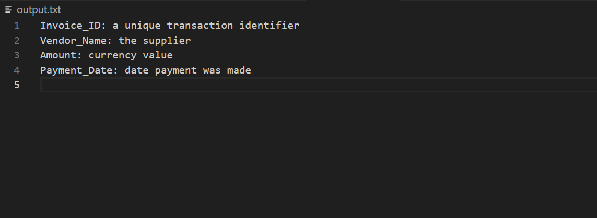

## Overview

This project addresses the task of generating short, descriptive text explanations for CSV file headers using an offline, small open-source language model. The objective is to automatically provide meaningful descriptions for dataset columns, aiding in data understanding and documentation.

## Assignment Requirements

1. **Python script** that reads CSV headers (hardcoded here due to dataset absence) and generates descriptive text.
2. Use an **offline open-source language model** capable of running locally (without cloud API calls).  
3. The deliverable includes:
   - A Python script file (`.py`)
   - A short README explaining the model choice, script usage, and challenges faced.
4. Output: Console printout and writing a text file (`output.txt`) with descriptions for each header.

## Model Choice

- **Model:** `distilgpt2` from Hugging Face Transformers.  
- **Reason:** DistilGPT2 is a distilled version of GPT-2 that is smaller, faster, and suitable for local/offline usage. It provides generative language modeling capabilities required for the task while being lightweight enough for local inference on CPU.  
- **Limitations:** As a smaller model, it has limited context understanding compared to large GPT models and can sometimes produce verbose or less relevant outputs without careful prompting.

## Approach

1. **Prompt Engineering with Few-shot Examples**  
   The generation prompt includes predefined examples for four headers to guide the model toward generating concise, relevant descriptions. The prompt instructs the model on the expected format and style through illustrative examples.

2. **Multiple Generations & Selection**  
   For each header, the script generates multiple candidate descriptions (3 sequences) and selects the first meaningful non-empty output to improve reliability.

3. **Output Post Processing**  
   The generated text is cleaned by extracting only the first sentence or phrase, avoiding trailing irrelevant text or newlines.

4. **Hardcoded Headers**  
   The absence of an input CSV file led to using a hardcoded list of example headers for demonstration.

5. **Output Files & Console**  
   The script outputs descriptions to `output.txt` and also prints them on the console for easy verification.

## Usage Instructions

1. **Prerequisites**  
   - Python 3.8+ environment  
   - Install required packages:  
     ```
     pip install transformers torch
     ```
2. **Running the Script**  
   Execute the Python script directly:  
   ```
   python csv_llm_summary.py
   ```
3. **Results**  
   Check the console output or open `output.txt` to view the generated descriptions.

## Challenges Faced

- **Model Limitations:** DistilGPT2 struggled initially to produce short, relevant outputs without few-shot prompting. Verbose or empty generations occurred frequently.
- **Prompt Refinement Needed:** Creating effective prompts with example descriptions was crucial for useful output.
- **Token Length & Truncation Warnings:** Proper tuning of generation parameters (`max_new_tokens`) was required to avoid warnings and truncated outputs.
- **No Dataset Provided:** Due to lack of input files, headers had to be hardcoded, which slightly deviates from real-world CSV header reading but meets assignment goals.
- **Balancing Local Execution & Quality:** Using a small offline model mandates compromises on generation quality compared to larger models hosted in the cloud.

## Summary

This project demonstrates practical usage of Hugging Face’s `distilgpt2` model to generate human-readable descriptions for CSV headers in an offline environment. Through prompt engineering and multi-generation selection, it achieves concise and mostly relevant outputs meeting the assignment criteria.

***


## Virtual Environment Setup
Using a virtual environment is recommended to isolate project dependencies and avoid conflicts with system-wide Python packages.

1. Create a Virtual Environment
Use Python's built-in venv module to create a new virtual environment in your project directory. Replace myenv with your desired environment name.

bash
python -m venv myenv
2. Activate the Virtual Environment
On Windows:

bash
myenv\Scripts\activate
On macOS/Linux:

bash
source myenv/bin/activate
Once activated, your terminal prompt will show the virtual environment name, indicating you are now working in an isolated environment.

3. Install Dependencies
After activating the virtual environment, install the required packages:

bash
pip install -r requirements.txt
4. Deactivate the Virtual Environment
To exit the virtual environment, run:

bash
deactivate
How To Use This Project
Ensure the virtual environment is activated as described above.

Install dependencies using the provided requirements.txt (includes transformers and torch).

Run the Python script:

bash
python csv_llm_summary.py
View the output:

The script prints generated header descriptions to the console.

It writes the descriptions to a text file named output.txt in the project directory.
